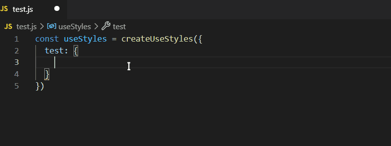
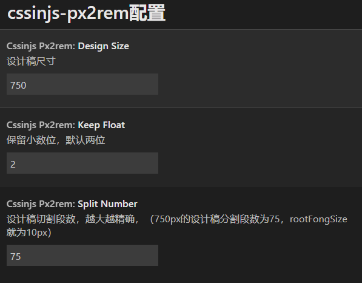

# cssinjs-px2rem 

cssinjs中px自动转化rem的好帮手,(请确保您的vscode版本不低于1.54.0)

## 支持文件格式
jsx, tsx, javascript
## 插件设置
进入vscode编辑器，`文件` -> `首选项` -> `设置` ，找到 `cssinjs-px2rem`扩展

| key | 描述 | 默认值 |
|-----|------|-------|
| DesignSize | 设计稿尺寸，单位（px） | 750 |
| SplitNumber | 设计稿分割段数，越大越精确，（例：750px的设计稿分割段数为75，rootFongSize就为10px）| 75 |
| KeepFloat | px转rem后精确小数位 | 2 |